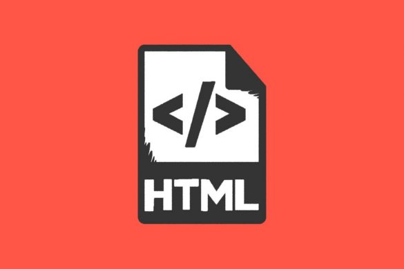

My works related to Hypertext Markup Language (HTML).

## Table of Contents
1. [Introduction.](#introduction)
2. [Official references websites.](#references)
3. [GitHub notes.](#github)

<a name="introduction"></a>
## Introduction


Hypertext Markup Language (HTML) is the standard markup language for documents designed to be displayed in a web browser. It can be assisted by technologies such as Cascading Style Sheets (CSS) and scripting languages such as JavaScript.

Web browsers receive HTML documents from a web server or from local storage and render the documents into multimedia web pages. HTML describes the structure of a web page semantically and originally included cues for the appearance of the document.

HTML elements are the building blocks of HTML pages. With HTML constructs, images and other objects such as interactive forms may be embedded into the rendered page. HTML provides a means to create structured documents by denoting structural semantics for text such as headings, paragraphs, lists, links, quotes and other items. HTML elements are delineated by tags, written using angle brackets. Tags such as `` and `<input>` directly introduce content into the page. Other tags such as `<p>` surround and provide information about document text and may include other tags as sub-elements. Browsers do not display the HTML tags, but use them to interpret the content of the page.

<a name="references"></a>
## Official references websites <br />
World Wide Web Consortium (W3C) website : https://www.w3.org <br />
Evolution of the Internet : http://www.evolutionoftheweb.com <br />

Mozilla official website : https://www.mozilla.org <br />
Stack Overflow question and answer site : https://stackoverflow.com <br />
W3Schools educational website : https://www.w3schools.com <br />

**_HTML documentations by Mozilla_** <br />
HTML \<header> by Mozilla : https://developer.mozilla.org/en-US/docs/Web/HTML/Element/header <br />
HTML \<span> by Mozilla : https://developer.mozilla.org/en-US/docs/Web/HTML/Element/span <br />
HTML Doctype by Mozilla : https://developer.mozilla.org/en-US/docs/Glossary/Doctype <br />
HTML lang by Mozilla : https://developer.mozilla.org/en-US/docs/Web/HTML/Global_attributes/lang <br />
HTML Head by Mozilla : https://developer.mozilla.org/en-US/docs/Glossary/Head <br />
HTML \<body>: The Document Body element by Mozilla : https://developer.mozilla.org/en-US/docs/Web/HTML/Element/body <br />
HTML \<div>: The Content Division element by Mozilla : https://developer.mozilla.org/en-US/docs/Web/HTML/Element/div <br />
HTML \<meta>: The Document-level Metadata element by Mozilla : https://developer.mozilla.org/en-US/docs/Web/HTML/Element/meta <br />
HTML \<title>: The Document Title element by Mozilla : https://developer.mozilla.org/en-US/docs/Web/HTML/Element/title <br />
HTML attribute: rel by Mozilla : https://developer.mozilla.org/en-US/docs/Web/HTML/Attributes/rel <br />
HTML id by Mozilla : https://developer.mozilla.org/en-US/docs/Web/HTML/Global_attributes/id <br />
HTML \<nav>: The Navigation Section element Mozilla : https://developer.mozilla.org/en-US/docs/Web/HTML/Element/nav <br />
HTML \<main> by Mozilla : https://developer.mozilla.org/en-US/docs/Web/HTML/Element/main <br />
HTML \<section>: The Generic Section element by Mozilla : https://developer.mozilla.org/en-US/docs/Web/HTML/Element/section <br />
HTML \<h1>–\<h6>: The HTML Section Heading elements by Mozilla : https://developer.mozilla.org/en-US/docs/Web/HTML/Element/Heading_Elements <br />

**_HTML documentations by w3schools.com_** <br />
HTML Links by w3schools.com : https://www.w3schools.com/html/html_links.asp <br />
HTML name Attribute by w3schools.com : https://www.w3schools.com/tags/att_name.asp <br />
HTML content Attribute by w3schools.com : https://www.w3schools.com/tags/att_content.asp <br />
HTML \<a> href Attribute by w3schools.com : https://www.w3schools.com/tags/att_a_href.asp <br />
HTML The class Attribute by w3schools.com : https://www.w3schools.com/html/html_classes.asp <br />
HTML \<li> Tag by w3schools.com : https://www.w3schools.com/tags/tag_li.asp <br />
HTML \<ul> Tag by w3schools.com : https://www.w3schools.com/tags/tag_ul.asp <br />
HTML \<input type="submit"> by w3schools.com : https://www.w3schools.com/tags/att_input_type_submit.asp <br />
HTML HTTP Request Methods by w3schools.com : https://www.w3schools.com/tags/ref_httpmethods.asp <br />
HTML Forms by w3schools.com : https://www.w3schools.com/html/html_forms.asp <br />
HTML \<i> Tag by w3schools.com : https://www.w3schools.com/tags/tag_i.asp <br />
HTML Symbols by w3schools.com : https://www.w3schools.com/html/html_symbols.asp <br />
HTML DOM addEventListener() Method by w3schools.com : https://www.w3schools.com/jsref/met_document_addeventlistener.asp <br />
HTML Select add() Method by w3schools.com : https://www.w3schools.com/jsref/met_select_add.asp <br />
HTML \<nav> Tag by w3schools.com : https://www.w3schools.com/tags/tag_nav.asp <br />
HTML \<i> Tag by w3schools.com : https://www.w3schools.com/tags/tag_i.asp <br />
HTML \<footer> Tag by w3schools.com : https://www.w3schools.com/tags/tag_footer.asp <br />

**_HTML questions and answers by Stack Overflow_** <br />
What if I use #! instead of # in href of anchor tag <a>? by Stack Overflow : https://stackoverflow.com/questions/41394896/what-if-i-use-instead-of-in-href-of-anchor-tag-a <br />

**_HTML articles_** <br />
HTML Document Character Set : https://www.w3.org/TR/WD-html40-970708/charset.html <br />
  
**_HTML developers_** <br />
Hypertext Markup Language (HTML) was created by Sir Timothy John Berners-Lee : https://github.com/timbl, https://twitter.com/timberners_lee, https://www.w3.org/People/Berners-Lee <br />

<a name="github"></a>
## GitHub notes
Initialize repository, adding GitHub remote repository and check the remote repository
```
$ git init
$ git remote add origin https://github.com/syakirharis25/HTML.git
$ git remote -v
$ git status
```
